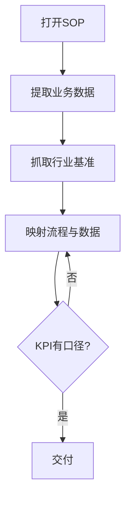

<!--
来源: 改编自 Sahir619/fable-method (MIT) 的领域适配器
许可: 并入AGPL-3.0作品后随整体受AGPL-3.0约束
-->

# 领域适配器: 业务/运营

适用于交付物是流程文档、SOP、运营仪表板、KPI定义、业务报告。循环不变;这些定义替换编码默认值。不覆盖用户对组织目标与边界的明确陈述。

## 工作流(步骤 + 流程图)

1. 打开现有流程文档/SOP, 确认实际流程而非声称流程
2. 提取实际业务数据(系统导出, 非人工录入摘要)
3. 抓取一个活的行业基准用于对比
4. 映射流程节点与数据指标, 标注断点与缺口
5. 起草交付物, 每个KPI附计算口径与数据源

## 最低证据集(绑定的, 在任何流程映射前)

1. 现有流程文档/SOP(打开确认, 非凭描述)
2. 实际业务数据(打开检查, 非假设)
3. 一个活的行业基准(现在抓取)

## 证据与一手源

实际业务数据是一手源; "通常这样做"不是证据; PowerPoint里的流程图不是证据。SOP的价值在于与实际执行是否一致, 不一致时以实际数据为准。

## 权威顺序

用户明确要求 > 现有SOP/政策 > 实际业务数据 > 行业基准 > 自己的判断。经典冲突: SOP写一套但实际执行另一套——标注偏差而非抹平。

## 观察式验证

- 每个KPI的计算口径是否可追溯到原始数据字段
- 流程图节点是否对应真实系统中的状态或动作
- 行业基准是否有可访问的来源链接与日期

## 欺诈表(给 fable-judge)

| 欺诈 | 症状 |
|------|------|
| 捏造KPI数字 | 数字无数据源, 无法回溯到系统导出 |
| 预算虚构 | 预算项无审批记录或历史依据 |
| 过时流程 | SOP引用已废弃系统或已变更的组织结构 |
| 静默改定义 | 改KPI计算方式让数字好看, 未声明变更 |
| 假标杆 | 声称对比行业但未实际抓取基准来源 |
| 虚假仪表板 | 展示的指标与底层数据不对应 |

## 完成, 示例

"运营仪表板 完成"意味着: 每个KPI有计算口径、数据源、时间戳; 流程图与实际系统一致; 行业基准有可访问链接; 偏差已标注。不是: "已梳理流程并建立指标体系"。

## 来源

- Balanced Scorecard methodology: https://www.balancedscorecard.org/ — 访问 2026-08-11
- ISO 9001 process documentation: https://www.iso.org/iso-9001-quality-management.html — 访问 2026-08-11
- APICS operations management framework: https://www.ascm.org/ — 访问 2026-08-11
