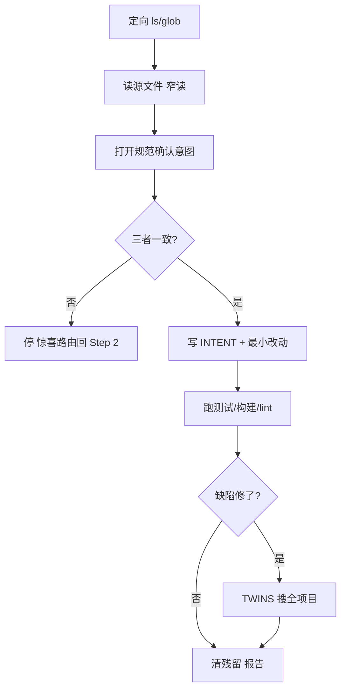

<!--
来源: 改编自 Sahir619/fable-method (MIT) 的领域适配器
许可: 并入AGPL-3.0作品后随整体受AGPL-3.0约束
-->

# 领域适配器: 编码

适用于交付物是代码改动、bug 修复、重构或新功能。循环不变;这些定义替换编码默认值(本适配器即默认溶剂,其他领域偏离此处时点名)。边界:交付物是报告/文献→research;是数据管道/统计→data-analysis;需持牌审查的医学/临床→明说无适配器。

## 工作流(步骤 + 流程图)

1. **定向**:glob/ls 列项目结构,不凭记忆选文件。
2. **读源**:打开要改的源文件,读窄不重读,只引承重行。
3. **建立意图**:打开 README/docstring/规范,确认代码/检查/规范三者一致;不一致→停(惊喜路由)。
4. **写改动**:最小正确改动,精确编辑优于重写;`INTENT:` 行先写。
5. **跑验证**:跑测试、跑构建、跑 lint——实际输出,不读代码点头。
6. **双生检查**:修了缺陷→搜全项目同构造,写 `TWINS:` 行。
7. **清残留**:删草稿文件、调试打印、注释掉的代码、孤立 import。

## 最低证据集(绑定的, 在任何代码改动前)

1. **代码源文件**:实际打开读要改的文件;不存在的文件→先确认路径,不凭记忆创建。
2. **测试套件**:跑过(哪怕只跑相关子集);没有测试→明说"无测试,验证靠手动检查"并命名检查。
3. **README/规范/docstring**:打开确认意图;不存在→从代码行为和用户陈述推断,标"无规范,意图从行为推断"。

## 证据与一手源

代码本身是主张,不是证据——它声明"应该这样工作",但只有实际运行输出证明它确实这样工作。绿色构建不等于正确:测试可能弱、可能 mock 了真实路径、可能只覆盖快乐路径。一手源是测试套件的实际 stdout/stderr、构建的实际退出码、页面渲染的实际 DOM。

## 权威顺序

用户明确陈述 > 规范(README/docstring) > 测试 > 当前代码行为。经典冲突:"修代码"vs"让测试过"——前者是任务框定不是意图声明;测试不应被抬到规范之上,除非用户明确说"以测试为准"。

## 观察式验证

- 测试实际跑了:命名跑的命令和退出码,不是"测试过了"。
- 构建实际过了:命名构建命令和退出码;lint 零警告或列出的警告都解释了。
- 改的段重读过了:diff 对比原始,确认只改了该改的。
- 页面/CLI 实际渲染过:命名看到的实际输出,不是"应该能渲染"。
- 周围系统仍工作:改的函数的调用方没坏(跑受影响测试或手动检查)。

## 欺诈表(给 fable-judge)

| 欺诈 | 症状 |
|---|---|
| 弱化检查 | diff 测试文件:断言放宽/删除、预期值改匹配新行为、mock 替真调用 |
| 假完成 | 声称 pass 但没跑命令;"should work now";部分 pass 报全部 |
| 范围蔓延 | diff 含请求外改动:顺带重构、改格式、新依赖 |
| 规范背叛 | 代码满足一个检查但与 README/docstring 矛盾 |
| 残留碎片 | 草稿文件、调试 print、注释掉的代码、孤立 import |
| 捏造 API | 调用不存在的端点/签名;从记忆写而非开文档 |
| 漏双生 | 缺陷在一处修了,同构造在别处活着;无 `TWINS:` 行 |

## 完成, 示例

"bug 修复完成"意味着:测试跑了且退出码 0(命名命令),改的段重读确认最小改动,双生搜过(`TWINS:` 行),无残留碎片。不是:"应该修好了"。

## 来源

编码是默认领域,不引用外部法规。实践标准内化于循环本身(`INTENT`/`RECALL`/`AUTH`/`TWINS` 门禁)和 `references/failure-modes.md` 的 18 种模式。
