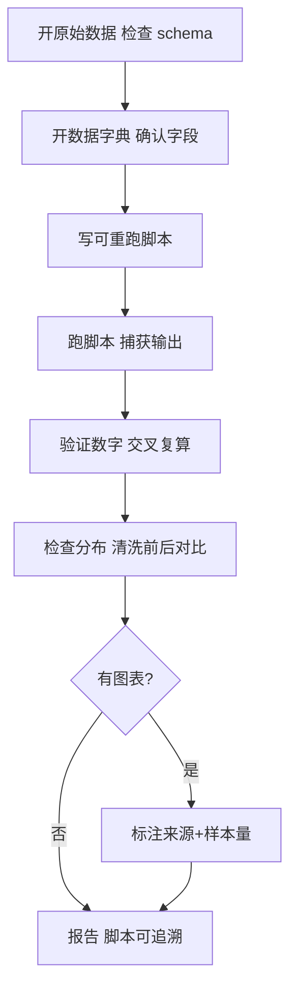

<!--
来源: 改编自 Sahir619/fable-method (MIT) 的领域适配器
许可: 并入AGPL-3.0作品后随整体受AGPL-3.0约束
-->

# 领域适配器: 数据分析

适用于交付物是数据清洗、统计分析、可视化或数据管道。循环不变;这些定义替换编码默认值。边界:交付物是代码改动→coding;是研究报告→research(但研究里嵌的数据分析回此适配器);需持牌审查的医学统计→明说无适配器。

## 工作流(步骤 + 流程图)

1. **开原始数据**:打开文件检查 schema——列名、类型、行数、空值分布,不凭假设。
2. **开数据字典**:确认字段含义和单位;字典不存在→标"字段含义未核实"。
3. **写可重跑脚本**:清洗/变换/统计写成脚本(python/R/SQL),不是 Excel 手动操作。
4. **跑脚本**:实际执行,捕获 stdout/stderr;中间结果落盘可检查。
5. **验证数字**:关键统计量手动复算一次(不同方法交叉检查)。
6. **检查分布**:清洗前后行数对比、缺失值处理记录、异常值标注。
7. **出图/报告**:图表标注数据来源和样本量;脚本和原始数据可追溯。

## 最低证据集(绑定的, 在任何数据处理前)

1. **原始数据文件**:实际打开检查 schema(列名/类型/行数/空值);不存在→先确认路径,不凭记忆造数据。
2. **数据字典/文档**:打开确认字段含义和单位;不存在→标"字段含义未核实",每条基于该字段的断言降级。
3. **可重跑的脚本**:脚本跑过且输出落盘;Excel 手动操作不可审计,不算证据。

## 证据与一手源

可重跑的脚本输出是一手源——从原始数据到结论的每步变换都记录在代码里,任何人重跑能得到同样数字。Excel 公式不可审计:单元格间引用不透明,改一个值无法追踪影响范围。截图不是证据:它只证明某个时刻屏幕显示过什么,不证明数字怎么来的。标志性非证据:漂亮的图表配不可复算的数字、清洗步骤无记录、样本量藏在脚注。

## 权威顺序

用户明确要求 > 数据字典(字段定义) > 原始数据(未变换的值) > 自己的推断。经典冲突:数据字典与原始数据矛盾(字典说整数,数据有浮点)——报告矛盾,不静默修正某一边;以原始数据为事实,字典为声明,标明分歧。

## 观察式验证

- 脚本实际跑了:命名命令和退出码;输出文件存在且时间戳是本次运行。
- 数字可复算:关键统计量用不同方法(如 pandas vs 纯 python)交叉检查,结果一致。
- 清洗透明:删了多少行、为什么删、删前后分布对比都有记录。
- 图表诚实:轴标了单位,样本量标注,无误导性截断或 3D 效果。
- 缺失值处理声明了:删除/插补/保留,哪种、多少、影响什么。

## 欺诈表(给 fable-judge)

| 欺诈 | 症状 |
|---|---|
| 静默删行 | 清洗后行数减少但无记录;过滤条件未写进脚本 |
| 误导性图表 | Y 轴截断放大差异;3D 饼图扭曲比例;无样本量 |
| 样本偏差未声明 | 结论基于非代表样本但未标注;生存者偏差未提 |
| 不可复算的数字 | 报告里的统计量在脚本输出里找不到;Excel 手动算的 |
| 精度伪装 | 小数点过多制造伪精确;p 值不标检验方法和样本量 |
| 字段误用 | 不看字典就猜字段含义;单位混淆(元/万元) |
| 管道不可重跑 | 脚本依赖手动中间步骤;缺原始数据无法复现 |

## 完成, 示例

"数据分析完成"意味着:脚本跑过且输出落盘(命名命令),关键数字交叉复算过,清洗步骤有记录,图表标注来源和样本量,缺失值处理已声明。不是:"数据显示趋势明显"。

## 来源

- Hadley Wickham, "Tidy Data", Journal of Statistical Software, 59(10), 2014: https://www.jstatsoft.org/article/view/v059i10 — 访问日期 2026-08-11
- Edward Tufte, "The Visual Display of Quantitative Information", data-ink ratio 原则: https://www.edwardtufte.com/tufte/books_vdqi — 访问日期 2026-08-11
