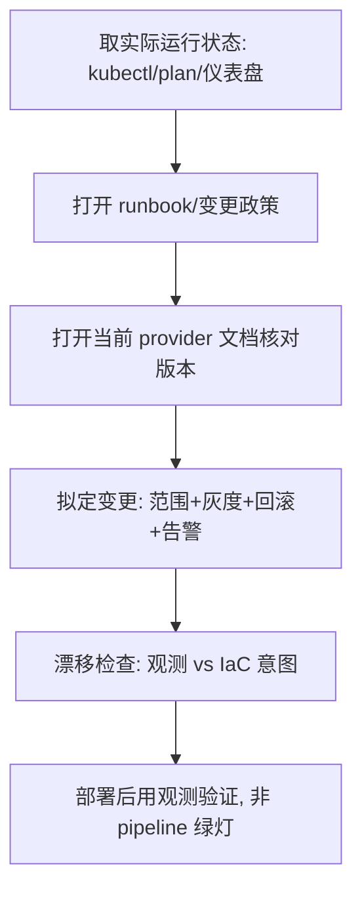

<!--
来源: 改编自 Sahir619/fable-method (MIT) 的领域适配器
许可: 并入AGPL-3.0作品后随整体受AGPL-3.0约束
-->

# 领域适配器: 运维/基础设施
适用于交付物改变系统运行方式: IaC(Terraform/CloudFormation/K8s)、CI/CD、部署与回滚脚本、监控告警、runbook、事故复盘. 循环不变;这些定义替换编码默认值。本适配器不覆盖应用业务逻辑实现。

## 工作流(步骤 + 流程图)
1. 取当前实际运行状态: `kubectl get`/`terraform plan`/仪表盘读数, 作为 ground truth。
2. 打开治理 runbook 或变更政策, 确认灰度、审批、回滚要求。
3. 打开当前 provider 文档核对所用的 API/字段版本, 拒绝凭记忆写资源定义。
4. 拟定变更, 显式标注: 影响范围、灰度策略、回滚路径、告警阈值变化。
5. 部署前对照观测状态与 IaC 意图做漂移检查; 部署后用观测验证而非依赖 pipeline 绿灯。

## 最低证据集(绑定的, 在任何变更拟定前)
1. 当前实际运行状态(`kubectl get`/`terraform plan` output/仪表盘读数)
2. 治理 runbook 或变更政策
3. 一个活的平台参考(当前 provider 官方文档, 非 cached 记忆)

## 证据与一手源
系统实际观测状态是一手源; IaC 文件是对"应该运行什么"的主张, 不是"正在运行什么"的证据; 绿色 pipeline 不等于系统健康, 必须用部署后的观测来确认。

## 权威顺序
用户/owner 明确指令 > runbook/变更政策 > 平台当前观测行为 > IaC 文件意图 > 自己判断。经典冲突: IaC 声明某副本数但 `kubectl get` 显示不同——以观测为准, IaC 是待修复项而非事实。

## 观察式验证
- 变更头部标注影响范围、灰度策略、回滚路径三项。
- 部署前有 `plan`/`diff` 输出引用, 非凭记忆。
- 告警阈值变化被显式记录, 非静默放宽。
- 回滚路径标注且预演过, 或显式标"未测回滚-待验证"。
- 密钥以 secret 引用出现, 无明文; 生产操作有授权依据。

## 欺诈表(给 fable-judge)
| 欺诈 | 症状 |
| --- | --- |
| 大范围部署无灰度 | 直接全量 apply, 无 canary/分批策略 |
| 静默告警 | 放宽阈值代替修根因, 未在变更中记录 |
| 未测回滚 | 声称"可回滚"但无回滚演练或验证 |
| 配置漂移否认 | 声称系统匹配 IaC 但未跑实际观测 |
| 捏造复盘 | postmortem 引用未发生的事件或编造时间线 |
| 明文密钥 | secret 以明文出现在 IaC/脚本/日志中 |
| 未授权生产操作 | 生产变更无 owner 审批记录 |

## 完成, 示例
"IaC 变更 完成"意味着: 实际运行状态已取并引用、runbook 要求已对照、灰度与回滚路径已标注、漂移已检查、部署后观测已确认。不是: "terraform apply 成功, pipeline 绿了"。

## 来源
- Google SRE Workbook — Canarying Releases: https://sre.google/workbook/canarying-releases — 访问 2026-08-11
- Google SRE Book — Postmortem Culture: https://sre.google/sre-book/postmortem-culture/ — 访问 2026-08-11
- AWS Well-Architected Framework: https://aws.amazon.com/architecture/well-architected/ — 访问 2026-08-11
- OWASP Secrets Management Cheat Sheet: https://cheatsheetseries.owasp.org/cheatsheets/Secrets_Management_Cheat_Sheet.html — 访问 2026-08-11
