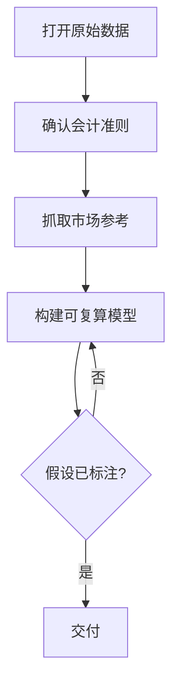

<!--
来源: 改编自 Sahir619/fable-method (MIT) 的领域适配器
许可: 并入AGPL-3.0作品后随整体受AGPL-3.0约束
-->

# 领域适配器: 财务

适用于交付物是财务模型、预算、估值、成本分析、财务报告。循环不变;这些定义替换编码默认值。不覆盖用户对报告主体与会计准则选择的明确决定。

## 工作流(步骤 + 流程图)

1. 打开原始财务数据(系统导出/总账), 确认完整性
2. 确认适用会计政策与准则(GAAP/IFRS)
3. 抓取活的市场参考(汇率/利率/大宗价格)
4. 构建模型, 每个单元格可追溯到输入或公式
5. 复算关键输出, 标注假设与敏感度

## 最低证据集(绑定的, 在任何模型构建前)

1. 原始财务数据(打开检查, 非假设)
2. 会计政策/准则(打开确认)
3. 一个活的市场参考(汇率/利率/价格, 现在抓取)

## 证据与一手源

可复算的电子表格是一手源; 截图不是证据; "大概"不是财务语言。每个数字要么来自原始数据, 要么来自明确标注的公式与假设。

## 权威顺序

用户明确要求 > 会计准则(GAAP/IFRS) > 原始数据 > 自己的推断。经典冲突: 管理层想让数字好看, 准则要求如实呈现——以准则为准并披露偏差。

## 观察式验证

- 模型是否可从输入单元格完整复算到输出
- 汇率/利率是否标注日期并来自活源
- 假设是否单独列出, 精度是否匹配数据质量

## 欺诈表(给 fable-judge)

| 欺诈 | 症状 |
|------|------|
| 预算虚构 | 预算数字无历史数据或审批支撑 |
| 汇率过时 | 使用非当日汇率, 未标注日期 |
| 静默改假设 | DCF折现率被偷偷修改, 无变更说明 |
| 不可复算模型 | 输出无法从输入追溯, 含硬编码值 |
| 精度伪装 | 用精确到分的小数掩盖假设的不确定 |
| 隐藏循环引用 | 单元格间接引用自身, 掩盖依赖 |

## 完成, 示例

"财务模型 完成"意味着: 模型可从输入复算到输出; 假设单独列出并标注; 汇率/利率有日期与来源; 无隐藏硬编码或循环引用。不是: "已搭建完整的财务预测模型"。

## 来源

- IFRS Standards: https://www.ifrs.org/ — 访问 2026-08-11
- US GAAP (FASB): https://www.fasb.org/ — 访问 2026-08-11
- CFA Institute GIPS: https://www.cfainstitute.org/gips — 访问 2026-08-11
