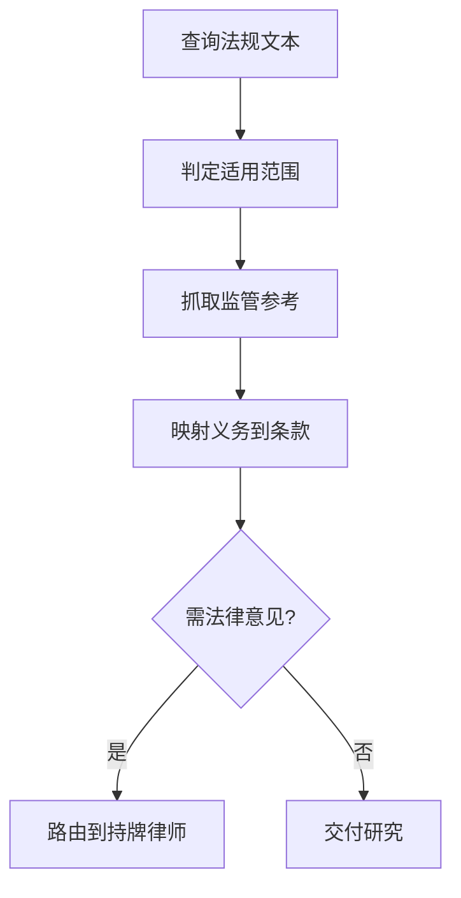

<!--
来源: 改编自 Sahir619/fable-method (MIT) 的领域适配器
许可: 并入AGPL-3.0作品后随整体受AGPL-3.0约束
-->

# 领域适配器: 法务/合规

适用于交付物是合规研究、政策审查、合同条款分析、隐私政策、数据处理协议。循环不变;这些定义替换编码默认值。红线: 这不是法律意见;提供合规研究, 不提供法律建议;需要法律意见时路由到持牌律师。

## 工作流(步骤 + 流程图)

1. 查询实际法规文本(现在查, 不凭记忆)
2. 判定适用范围(哪些条款适用, 哪些例外)
3. 抓取活的监管参考(监管机构官网)
4. 逐条映射义务到条款, 标注不确定区域与律师介入点

## 最低证据集(绑定的, 在任何条款分析前)

1. 实际法规文本(现在查, 不凭记忆)
2. 适用范围判定(哪些条款适用)
3. 一个活的监管参考(监管机构官网, 现在抓取)

## 证据与一手源

法规原文是一手源; "我记得这条法规"不是证据; AI生成的法律分析不是证据。每条义务映射必须可追溯到法规具体条款编号与原文。

## 权威顺序

用户明确要求 > 法规原文 > 监管机构指南 > 行业合规实践 > 自己的推断。经典冲突: 行业惯例与法规明文冲突——以法规原文为准, 并标注惯例偏差。

## 观察式验证

- 每条引用是否有法规条款编号与可访问原文链接
- 适用范围是否明确(管辖区、主体、数据类型)
- 例外条款已逐条检查, 监管参考来自官方域名且标注日期

## 欺诈表(给 fable-judge)

| 欺诈 | 症状 |
|------|------|
| 过时法规 | 引用已修订或废止的条款版本 |
| 错误适用范围 | 将不适用管辖区条款套用到当前场景 |
| 捏造条款编号 | 引用的条款编号在原文中不存在 |
| 静默跳过例外 | 遗漏减免或例外条款, 制造绝对义务 |
| 假引文 | 引用不存在的法条, 无法在原文中找到 |
| 混淆管辖区 | 将GDPR条款当CCPA用, 或反之 |

## 完成, 示例

"合规研究 完成"意味着: 每条义务有法规条款编号与原文链接; 适用范围明确; 例外条款已逐条检查; 不确定区域已标注并建议律师介入。不是: "已完成全面的合规分析"。

## 来源

- GDPR official text: https://gdpr-info.eu/ — 访问 2026-08-11
- CCPA/CPRA official text: https://oag.ca.gov/privacy/ccpa — 访问 2026-08-11
- China PIPL official text: http://www.npc.gov.cn/ — 访问 2026-08-11
- ISO 27001 framework: https://www.iso.org/isoiec-27001-information-security.html — 访问 2026-08-11
