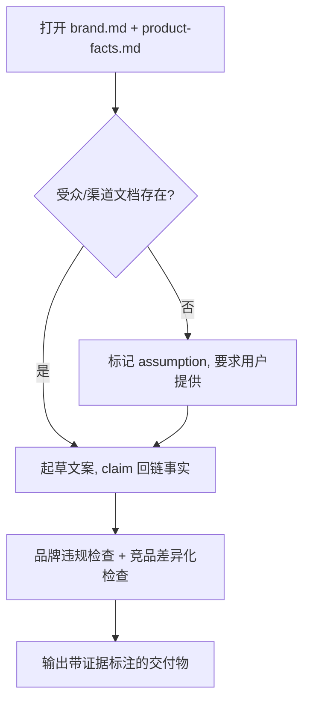

<!--
来源: 改编自 Sahir619/fable-method (MIT) 的领域适配器
许可: 并入AGPL-3.0作品后随整体受AGPL-3.0约束
-->

# 领域适配器: 营销/内容
适用于交付物是落地页文案、广告创意、邮件序列、品牌内容、SEO 内容. 循环不变;这些定义替换编码默认值。本适配器不覆盖产品工程或法律合规审查。

## 工作流(步骤 + 流程图)
1. 打开 `brand.md` 逐条核对 voice/tone/用词红线; 打开 `product-facts.md` 逐条核对功能与数据。
2. 确认目标受众与渠道文档存在性; 缺失则标记 assumption 并要求用户提供。
3. 起草文案, 每条 claim 回链到 product-facts.md 的具体条目或标注"无证据-待核"。
4. 对照品牌指南做违规模糊检查; 对照竞品参考做差异化检查。
5. 输出标注证据来源的交付物, 拒绝无证据支撑的功效声明。

## 最低证据集(绑定的, 在任何文案起草前)
1. 品牌指南 `brand.md`(打开核对, 不是凭记忆)
2. 产品事实文档 `product-facts.md`(逐条核对, 不是"大致知道")
3. 目标受众/渠道文档(如果存在; 不存在则显式标记缺失)

## 证据与一手源
品牌指南与产品事实文档是一手源; "听起来对"不是证据; AI 生成的文案不是证据, 被引用的竞品素材必须回到原始来源核对。任何统计数字必须有可追溯的出处, 否则不得写入。

## 权威顺序
用户明确要求 > 品牌指南 > 产品事实文档 > 自己的创意判断。经典冲突: 用户要求一个违反品牌红线的表述——此时应指出冲突并要求用户显式覆盖, 而非静默顺从。

## 观察式验证
- 每个 claim 旁标注来自 product-facts.md 的条目编号或"待核"。
- 品牌用词红线列表逐项过, 有命中即标记。
- 受众/渠道文档缺失时, 交付物头部有显式 assumption 块。
- 功效声明无证据的, 已删除或转为待核占位, 未直接保留。
- 抄袭检查: 竞品原句未直接搬入, 仅作参考。

## 欺诈表(给 fable-judge)
| 欺诈 | 症状 |
| --- | --- |
| 捏造统计 | 数字无来源或来源不可追溯 |
| 过时数字 | 引用 product-facts.md 已删除/更新的条目 |
| 品牌违规 | 用词/语气命中 brand.md 红线但未标记 |
| 未核实的功效声明 | "提升 X%"无 A/B 或第三方数据支撑 |
| 抄袭竞品 | 直接搬运竞品原句而非借鉴结构 |
| 假 A/B 测试 | 声称"测试胜出"但无实验记录 |
| 假受众 | 编造 persona 填补缺失的受众文档 |

## 完成, 示例
"落地页文案 完成"意味着: 所有 claim 有 product-facts 回链、品牌红线逐项过、缺失证据的声明已转"待核"、受众假设已显式标注。不是: "文案已写好, 读起来很有吸引力"。

## 来源
- FTC advertising guidelines: https://www.ftc.gov/business-guidance/resources/advertising-marketing — 访问 2026-08-11
- Brand style guide best practices: https://www.frontify.com/guide/brand-guidelines — 访问 2026-08-11
- Content marketing evidence standards: https://contentmarketinginstitute.com/what-is-content-marketing — 访问 2026-08-11
