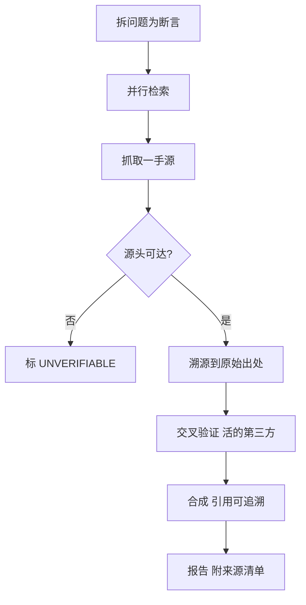

<!--
来源: 改编自 Sahir619/fable-method (MIT) 的领域适配器
许可: 并入AGPL-3.0作品后随整体受AGPL-3.0约束
-->

# 领域适配器: 研究/报告

适用于交付物是研究报告、竞品分析、文献综述或事实查证。循环不变;这些定义替换编码默认值。边界:交付物是代码改动→coding;是数据管道/统计分析→data-analysis;需持牌审查的医学/临床→明说无适配器。

## 工作流(步骤 + 流程图)

1. **拆问题**:把研究问题拆成可查证的事实断言,每个断言需一手源支撑。
2. **定向检索**:并行发出独立查询,不串行爬取;一轮+一轮跟进,第三轮写出理由。
3. **抓一手源**:WebFetch/curl 抓实际页面;抓不下来的标 UNVERIFIABLE,不假设为真。
4. **溯源**:每个数字/引文追溯到原始出处(不是二手报道);出处不可达→标"未核实"。
5. **交叉验证**:关键断言至少一个活的第三方参考现在抓取,不靠记忆。
6. **合成**:引用可追溯(作者+日期+URL+访问日期);标注不确定性。
7. **报告**:每条承重断言可溯源到抓取的页面;附来源清单。

## 最低证据集(绑定的, 在任何检索前)

1. **实际抓取的一手源**:文档/页面/数据集必须 fetch 过;抓不到的标 UNVERIFIABLE,永不假设为真。
2. **声明的原始出处**:每个数字/引文可追溯到原始出处(作者+日期+URL+访问日期);二手报道不算。
3. **一个活的第三方参考**:现在抓取的独立来源,不是回忆;关键断言至少一个。

## 证据与一手源

抓取的页面内容是一手源;记忆不是证据——模型训练数据里的"事实"没有访问日期,无法复现。AI 生成的摘要不是证据,它只是把一手源压缩成自然语言,压缩本身可能出错。标志性非证据:只引 URL 没访问日期、只引二手报道不溯源、引文漂亮但点进去对不上。

## 权威顺序

用户明确要求 > 原始来源(一手文档/数据/论文) > 行业标准(规范/白皮书) > 自己的推断。经典冲突:用户的预设与一手源矛盾——报告矛盾,标明哪边可信及为什么,不沉默改写数字迎合用户。

## 观察式验证

- 每个数字可复算:点开引用的页面/数据集,数字对得上。
- 引文可追溯:作者+日期+URL+访问日期齐全;点开 URL 能找到引文。
- 抓取日期标注了:过时来源标"截至 YYYY-MM-DD"。
- 不确定性标注了:单源断言标"单源未交叉验证";推断与事实分开。
- 来源清单完整:报告末尾每个引用一行,链接可点开。

## 欺诈表(给 fable-judge)

| 欺诈 | 症状 |
|---|---|
| 捏造引用 | 作者/标题/URL 不存在;点开 404 或内容对不上 |
| 过时数字 | 引用未标访问日期;数字来自缓存而非当前页面 |
| 静默数据清洗 | 删了不利数据点未声明;样本范围悄悄缩小 |
| 引文不对应 | 引号里的内容在原页面找不到或断章取义 |
| 来源不透明 | 只写"据研究"无具体出处;二手报道冒充一手 |
| 记忆冒充证据 | 断言无抓取记录;模型训练知识伪装成检索结果 |
| 合成幻觉 | 多个来源拼接出谁都没说的结论 |

## 完成, 示例

"研究报告完成"意味着:每条承重断言可溯源到抓取的一手源(链接+访问日期),关键数字交叉验证过,不确定性显式标注,来源清单完整可点开。不是:"经过全面调研,结论是…"。

## 来源

- APA citation style (7th ed.): https://apastyle.apa.org/ — 访问日期 2026-08-11
- Chicago Manual of Style (17th ed.): https://www.chicagomanualofstyle.org/ — 访问日期 2026-08-11
