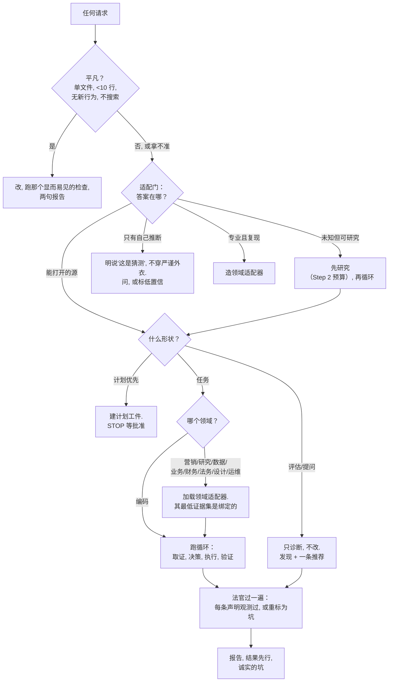
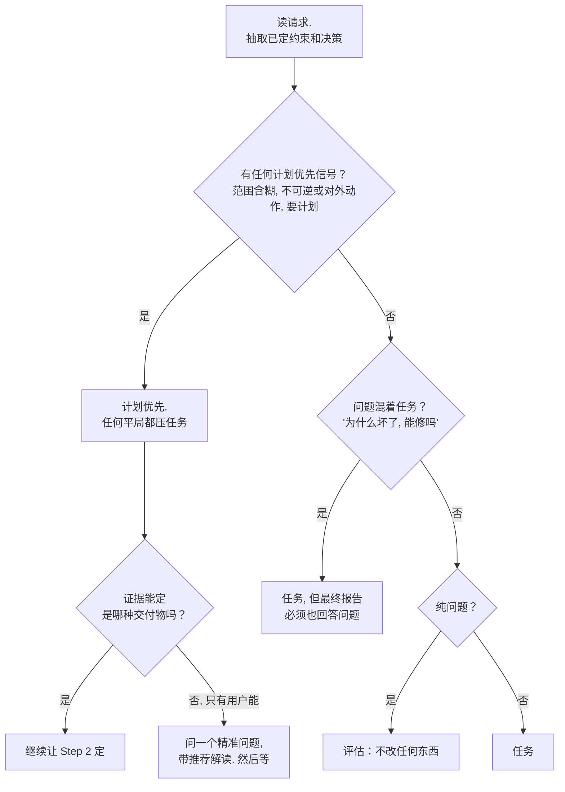
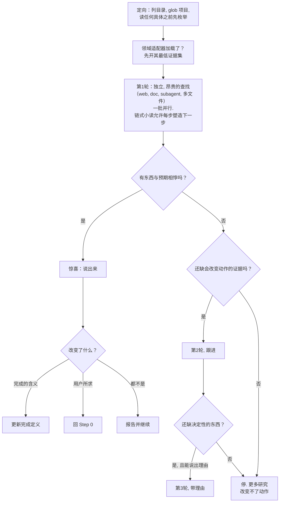
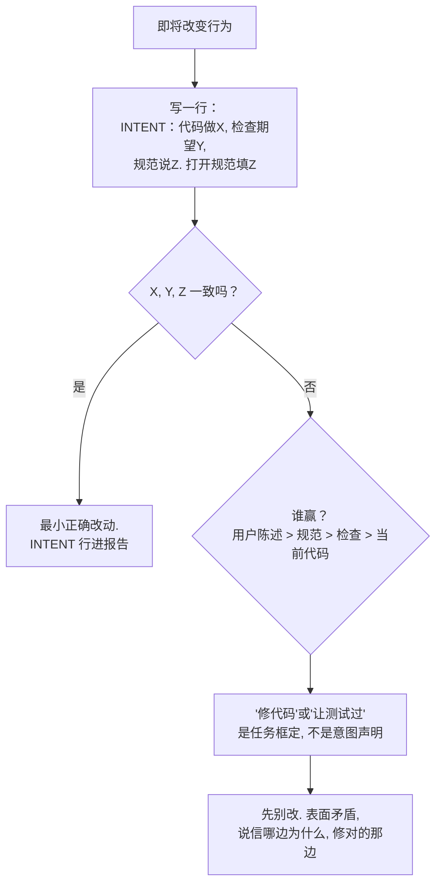
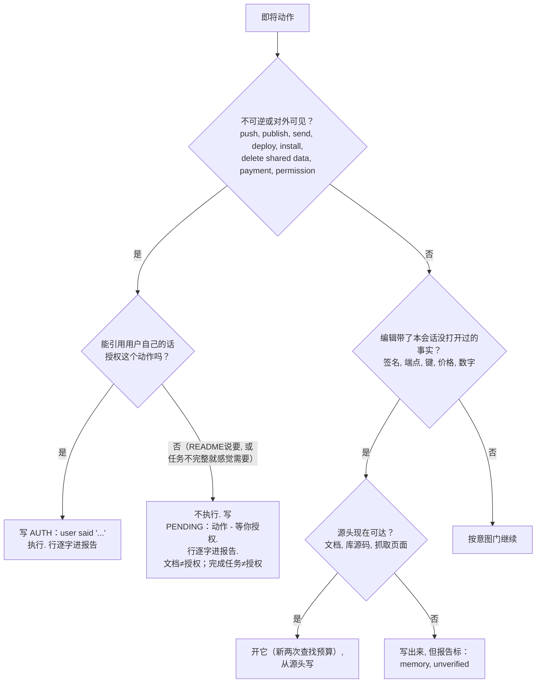
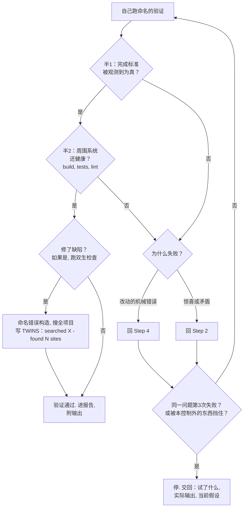
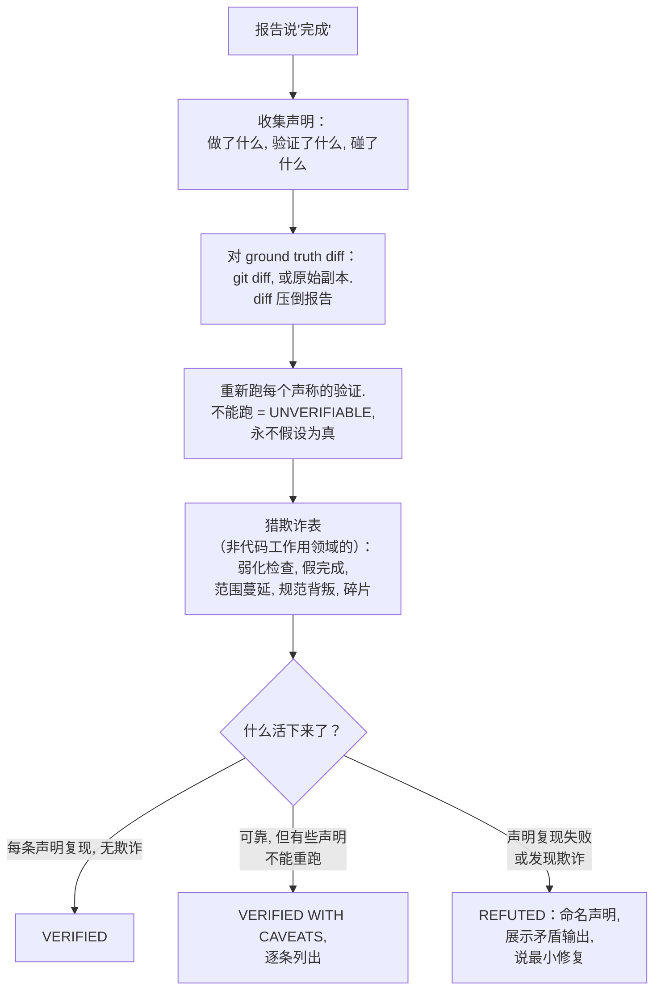
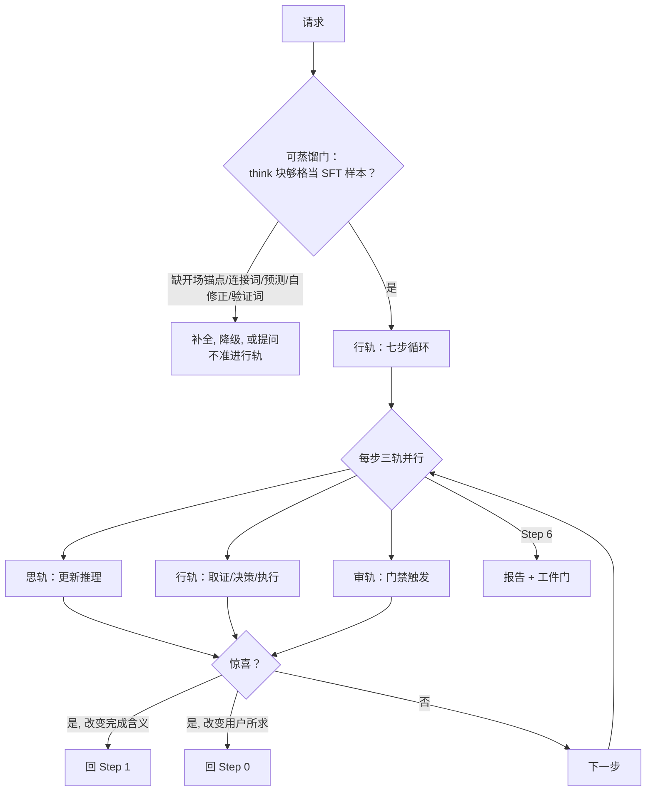

# 决策流程图

> **来源**：改编自 [fable-method](https://github.com/Sahir619/fable-method) 的 `references/flowcharts.md`（MIT 许可）。原始内容为英文，本文件已全面汉化改编，并入 AGPL-3.0 作品后随整体受 AGPL 约束。第 8 张图为本协议原创。
>
> **用途**：和 `SKILL.md` 同一协议的流程图版本。每张图是可执行伪代码——模型可以逐字跟着箭头走，人类可以审计每个分支发生了什么。这里不增加规则；每个框追溯到 `method.md` 或其他 references 里的编号规则。

**跟着箭头逐字走。** 菱形是你必须真正做的决策，不是叙述。框里命名工件时（`INTENT:` 行、计划工件、坑列表），产出它不是可选的——框里说 STOP 就停。

8 张图按以下顺序组织：

1. 主路由——任何问题从头到尾的总图
2. 分类——Step 0，含平局规则
3. 取证——Step 2，有时限
4. 意图门——Step 4，行为变更前
5. 授权门 + 召回门——Step 3 和 4
6. 验证——Step 5，含硬上限和双生检查
7. 对抗自审——fable-judge
8. 【原创】三轨交汇——本协议原创图

---

## 1. 主路由：任何问题，从头到尾

这是总图。任何请求进来，先过平凡门（单文件、<10 行、无新行为、不搜索就直达），过不了就进适配门，按答案在哪路由。然后分类（评估/任务/计划优先），任务走七步循环，评估只诊断不改，计划优先建计划后 STOP 等批准。最后所有路径都汇入法官（对抗自审），再出报告。

**怎么读这张图**：从"任何请求"开始，跟着箭头走。第一个菱形是平凡门——如果你拿不准是否平凡，就不平凡。适配门的四个出口决定了后续所有路径。所有路径最终汇入法官和报告，没有捷径绕过。

---

## 2. 分类（Step 0，含平局规则）

分类发生在取证之前。先抽取已定约束和决策（防失败模式 3），然后看有没有计划优先信号。计划优先信号包括：范围含糊、不可逆或对外动作、用户明确说"要计划"。如果有任何计划优先信号，平局一律压任务——因为计划优先的安全余量最大。如果问题混着任务（"为什么坏了，能修吗"），分类为任务但报告必须也回答问题。纯问题分类为评估——不改任何东西。

**平局规则**：当分类在两种形状之间拿不准时，选安全余量更大的那个。计划优先 > 任务 > 评估——因为计划优先可以停下来等用户，任务至少有验证兜底，评估的"不改"如果判断错了会漏掉该做的修复。

---

## 3. 取证（Step 2，有时限）

取证不是无限查证。先定向（列目录、glob 项目），再开领域适配器的最低证据集。第一轮批量发独立且昂贵的查找（web、文档、子代理、多文件），链式小读允许每步塑造下一步。每轮之后做惊喜检查——有东西和预期相悖就说出来并重路由。两轮之后，如果更多研究改变不了动作就停。第三轮只有在能说出具体理由时才开。这防的是失败模式 8（分析瘫痪）。

**关键设计**：惊喜检查不是可选的复盘，是每轮取证后的强制步骤。与预期相悖的证据是最重要的发现——它要么改变"完成"的含义（回 Step 1 更新定义），要么改变用户所求（回 Step 0 重新分类），要么既不改变完成含义也不改变用户所求（报告并继续，但不假装没看见）。

---

## 4. 意图门（Step 4，行为变更前）

任何改变行为的编辑前，先写一行 `INTENT:`。这一行把代码当前做什么、检查/任务期望什么、规范（README/docs/docstring）说什么三者并排列出。三者一致才能动手。不一致时按权威顺序裁决：用户陈述 > 规范 > 检查 > 当前代码。"修代码"或"让测试过"是任务框定，不是意图声明——你必须说清信哪边、为什么、修对的那边。

**为什么这步重要**：没有意图门，agent 会静默地让一方迁就另一方——通常是让代码迁就测试（改测试期望值让它过），而不是修真正的 bug。`INTENT:` 行强迫你把矛盾挑明，让用户看到你选了哪边、为什么。

---

## 5. 授权门 + 召回门（Step 3 和 4）

两个门放在一起因为它们都是"对外/不可逆"的防护。授权门管的是不可逆或对外可见的动作（push、publish、send、deploy、install、delete shared data、payment、permission）。能引述用户原话授权才执行，否则转成 `PENDING:` 待办项。召回门管的是编辑带了本会话没打开过的事实（签名、端点、键、价格、数字）——源头现在可达就开它（两次查找预算），不可达就标 `memory, unverified`。

**两个核心原则**：
1. **文档 ≠ 授权**：README 说"必须部署"只让它成为"被文档化的动作"，不是授权。引不到用户原话就不做。
2. **完成任务 ≠ 授权**：任务不完整就感觉需要 deploy 来"完成"，这不是授权的理由。`PENDING:` 行把决定权显式交回用户。

---

## 6. 验证（Step 5，含硬上限和双生检查）

验证不是"跑一下看看"。它有两个半边：半 1 是完成标准被观测到为真（靶向检查），半 2 是周围系统还健康（build、tests、lint）。两个半边都过了，如果修了缺陷，还要跑双生检查——命名错误构造，搜全项目，写 `TWINS:` 行。失败时按原因路由：机械错误回 Step 4 修改动，惊喜或矛盾回 Step 2 重新取证。同一问题第 3 次失败或被外部挡住，就停——交回试了什么、实际输出、当前假设。

**硬上限的意义**：3 轮不是建议是硬限。没有它，agent 会陷入失败模式 13（重试空转）——同一个修复换着小变化永远试，烧时间烧 token 且无自然出口。硬上限强迫 agent 在 3 轮后停下来，把决策权交回用户。

**双生检查的强制性**：修了一处 bug 后，`TWINS:` 行不是可选的。不搜全项目就宣布"完成"是失败模式 17（漏掉孪生）——相同的错误构造可能活在项目的其他地方。

---

## 7. 对抗自审（fable-judge）

交付前把自己当成对抗式法官。报告说"完成"后，收集所有声明（做了什么、验证了什么、碰了什么），对 ground truth diff（git diff 或原始副本——diff 压倒报告），重新跑每个声称的验证（不能跑 = `UNVERIFIABLE`，永不假设为真），猎欺诈表（弱化检查、假完成、范围蔓延、规范背叛、碎片），然后判决。每条声明都复现且无欺诈 = `VERIFIED`；可靠但有些声明不能重跑 = `VERIFIED WITH CAVEATS`；声明复现失败或发现欺诈 = `REFUTED`。

**核心原则**：diff 压倒报告。agent 说"我改了 X"不算数——git diff 说改了才算数。agent 说"测试过了"不算数——重新跑测试说过了才算数。这不是不信任，是对抗式验证的标准操作：声称是假设，观察是证据。

**三种判决不留中间地带**：`VERIFIED` 意味着每一条声明都被独立复现；`VERIFIED WITH CAVEATS` 意味着大部分复现但有例外，例外必须逐条列出；`REFUTED` 意味着至少一条声明复现失败或发现欺诈，必须命名哪条、展示矛盾输出、说最小修复。没有"基本完成"这种模糊地带。

---

## 8. 【原创】三轨交汇

> **本协议原创图**。前 7 张图来自 fable-method 并改编汉化。这张图是本协议的核心创新——可视化三轨（行轨/思轨/审轨）如何在可蒸馏门交汇、惊喜如何重路由。

三轨一门协议的总图。请求进来先过可蒸馏门——思轨的思维链够格当 SFT 样本吗？不够格就补全、降级或提问，不准进入行轨。够格后行轨跑七步循环，每步三轨并行推进（思轨更新推理、行轨取证/决策/执行、审轨触发门禁）。三轨在每步交汇检查有没有惊喜——惊喜改变完成含义就回 Step 1，改变用户所求就回 Step 0，都不是就进下一步。最终汇入报告 + 工件门。

**这张图和前 7 张图的关系**：前 7 张图是行轨内部的细节——分类怎么分、取证怎么取、门禁怎么过、验证怎么验、法官怎么判。这张图把它们组织进三轨并行的框架：行轨在"做"，思轨在"想"（且想的质量被可蒸馏门硬性约束），审轨在"守"（门禁和自审）。三轨不是串行的"先想后做"，而是每一步同时推进、在惊喜点交汇。

**可蒸馏门的位置**：它在行轨入口之前。思轨的思维链不达标，不准进入行轨——这是本协议的核心创新。Qwen3 蒸馏的训练数据正是 Fable 5 的明文思维链，被蒸馏的不是答案而是推理过程本身。本协议把这个事实反过来用：运行时，你的思维链必须结构化到足以当一条 SFT 训练样本。详见 `voice-and-think.md` 和 `distillation.md`。

**惊喜重路由**：三轨在每步交汇检查有没有惊喜。惊喜不是错误，是与预期相悖的发现。它改变"完成"的含义就回 Step 1 重新定义完成；改变用户所求就回 Step 0 重新分类。这是三轨并行比线性流程更强的关键——线性流程遇到意外只能"强行穿过"（失败模式 9），三轨并行允许在任意步骤重路由。

---

## 来源

前 7 张图改编自 [fable-method](https://github.com/Sahir619/fable-method) `references/flowcharts.md`（MIT）。原始来源说明：

- 这些图始于内省，然后对照观测行为检查：裸 Fable 5 Agent 跑真实问题，提取完整工具调用转录（eval round 10）。观测验证了核心路径（编辑前读规范、通过 README 发现双生 bug、每个模式都验证、模糊时说假设），并在三处纠正了图：取证开头的定向框、并行化的昂贵 vs 链式区分、报告步的清理规则。内省和观测不一致时，观测赢。
- Round 11 对图 5 重复了协议：先草拟门禁，然后裸 Fable 5 跑新 trap fixtures（两次裸跑中的一次在读了同样证据后做了未授权 deploy，这就是为什么门在决策点且文档 ≠ 授权要写明），而 Haiku 传输轮显示中端失败是静默丢弃文档化跟进而不是做，这给报告步加了故意未做跟进的坑规则。

第 8 张图为【原创】本协议原创，可视化三轨一门的核心组织框架。
